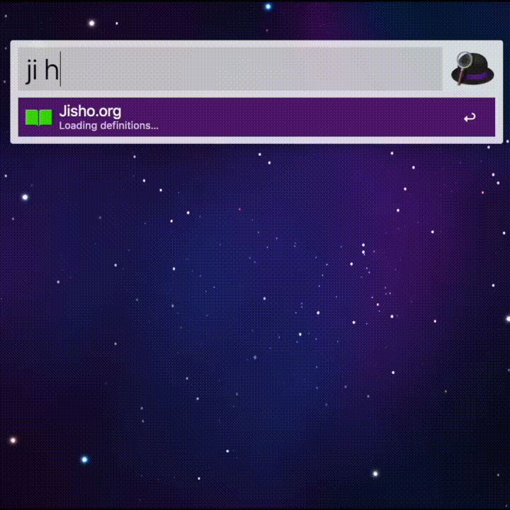

# Jisho Alfred Workflow

An [Alfred](https://www.alfredapp.com/) workflow to easily search [Jisho.org](http://jisho.org/), a powerful Japanese-English online dictionary. It uses the Jisho.org API to retrieve search results and instantly display them within Alfred's search results.

**[DOWNLOAD](https://github.com/feetstv/jisho-alfred/releases/download/1.0/Jisho.org.alfredworkflow)**

## Usage

### Search

Type `ji ` or `じ` followed by the word you want to search for. Note that there
is a space after `ji` and not after `じ`.

As [stated by Jisho.org](http://jisho.org/docs), searches for English words can be surrounded with *double quotes* to prevent searching for the word as romaji.

e.g. `ji "date"` would search for the English word "date" and `ji date` would
search for "だて".

### Open search result in browser

Press `Enter` on a search result to open the result on Jisho.org.

### Display large version of search result

Press `CMD`+`L` on a search result to display a large version of the kanji or kana. This is useful for looking at detailed kanji.

### Update

Jisho Alfred Workflow checks for updates once a day during the first search. If an update is found, it will be downloaded automatically and ask to be applied.

To check for updates manually, enter `ji workflow:update` in Alfred.

## Credits

Forked from [Jan Clarin's original workflow](https://github.com/janclarin/jisho-alfred) to use Python 3.

This workflow uses [NorthIsUp's Alfred-Workflow library](https://github.com/NorthIsUp/alfred-workflow), licensed under [The MIT License](https://github.com/deanishe/alfred-workflow/blob/master/LICENCE.txt).

The [icon](src/icons/icon.png) is a recreation of the book above the Jisho.org logo.

Thank you to the people at [Jisho.org](http://jisho.org/about) for making a great service and an [API](http://jisho.org/forum/54fefc1f6e73340b1f160000-is-there-any-kind-of-search-api).
